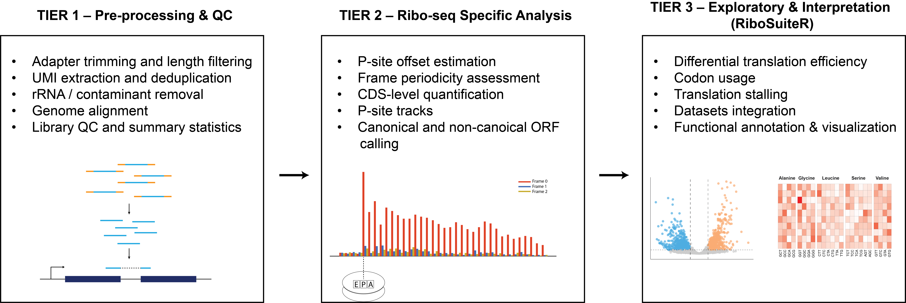

# RiboSuite

RiboSuite is a comprehensive, end-to-end Nextflow (DSL2) pipeline for ribosome profiling (Ribo-seq) data analysis, with optional RNA-seq integration. It is designed to support both canonical ORFs and the discovery of smORFs and other non-canonical translation events, with a focus on robustness, flexibility, and sensitivity to low-signal translation.

---

## Overview



---

## Features

### End-to-end Ribo-seq processing
- Adapter trimming with optional rescue
- UMI handling and deduplication
- rRNA/tRNA contamination removal
- STAR-based alignment

### Quality control
- Read length distribution
- Frame periodicity
- Metagene profiles
- P-site distribution

### ORF discovery and quantification
- Detection of translated ORFs including smORFs
- Frame-aware quantification using P-sites
- Metrics:
  - Frame fraction (PIF-like)
  - Uniformity
  - Stop-codon drop-off

### RNA-seq integration (optional)
- FASTP preprocessing
- STAR alignment
- Junction-aware two-pass alignment for improved Ribo-seq mapping

### Track generation
- BigWig and bedGraph outputs
- Strand-specific and length-specific tracks

### Sample merging (optional)
- Enhances signal for lowly translated smORFs
- Merges signal at the track level (no BAM merging)
- Improves statistical support and visualization

---

## Motivation

Most existing pipelines focus primarily on canonical protein-coding ORFs.  
RiboSuite is designed to better support:

- smORFs and microproteins  
- non-canonical translation  
- low-signal ribosome footprints  

---

## Workflow

Key modules include:

- PREPROCESS_READS  
- STAR_RIBO_ALIGN  
- PSITE_OFFSET  
- RIBO_QC_BASIC  
- CDS_QUANT  
- PSITE_TRACK  
- TRANSLATED_ORFS  
- RNA_QUANT (optional)  
- RNA_TRACK (optional)  

---

## Installation

```bash
git clone https://github.com/your-username/RiboSuite.git
cd RiboSuite
```

Example dependency setup with conda:

```bash
conda create -n ribosuite -c bioconda -c conda-forge \
    nextflow star cutadapt samtools bedtools subread
conda activate ribosuite
```

---

## Usage

```bash
nextflow run workflows/ribosuite_integrated.nf \
    -profile pbs \
    --samples samples.tsv \
    --outdir results \
    --enable_psite_track \
    -resume
```

---

## Input

Example `samples.tsv`:

| sample_id | fastq1 | fastq2 | adapter_3 | assay | organism |
|----------|--------|--------|-----------|-------|----------|
| sample1  | file1  | NA     | ADAPTER   | ribo  | human    |

---

## Output Structure

```
results/
├── ribo/
│   ├── align/
│   ├── qc/
│   ├── psite_tracks/
│   ├── cds_quant/
│   └── orf_calling/
└── rna/
    ├── align/
    ├── quant/
    └── tracks/
```

---

## Figures

All figures are stored under:

```
docs/figures/
```

Example:

```
docs/
└── figures/
    ├── RiboSuiteOverview.png
    ├── figure2.png
    └── figure3.png
```

---

## License

MIT License
